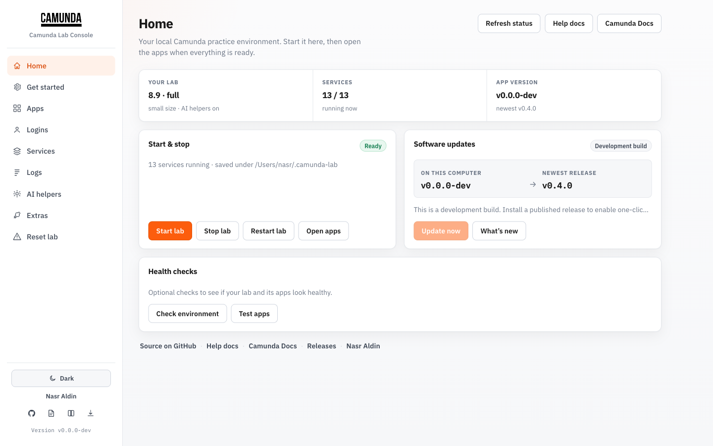

# Camunda Lab

{: .brand-logo }

Local Camunda 8 on Docker. One CLI — **`camunda`** — wraps Camunda’s official Compose zips so you can install a minor, wait until it’s healthy, open Operate, and switch versions without digging through README ports.

Current release: **[v0.6.0](https://github.com/nasraldin/camunda-lab/releases/tag/v0.6.0)** (Lab UI auto-start, friendly Docker errors, `camunda ui logs`, Camunda 8.7–8.10).



!!! tip "Lab UI"
Run `camunda ui` for the browser control panel — install, open apps (optional auto sign-in), services, logs, AI helpers. Full walkthrough: [Lab UI](lab-ui.md).

!!! warning "Unofficial"
Community project. Not affiliated with Camunda GmbH. Fine for local tryouts — not production. For production, use [Camunda’s Helm charts](https://docs.camunda.io/docs/self-managed/setup/install/).

## Install the CLI

=== "Homebrew"

    ```bash
    brew tap nasraldin/tools
    brew install camunda-lab
    camunda about
    ```

    Formula name is `camunda-lab`; the binary is still `camunda`.

=== "One-liner"

    Downloads a release binary and checks `checksums.txt`:

    ```bash
    curl -fsSL https://raw.githubusercontent.com/nasraldin/camunda-lab/main/install.sh | bash
    ```

=== "From source"

    ```bash
    git clone https://github.com/nasraldin/camunda-lab.git
    cd camunda-lab
    make build
    make install   # ~/.local/bin/camunda
    ```

You need Docker with Compose v2 (`docker compose version`). On Apple Silicon without Desktop, [docker-lab](https://github.com/nasraldin/docker-lab) is a solid way to get an Engine.

## First run

```bash
camunda install --version 8.9 --profile light --resources small --yes
camunda wait
camunda urls
camunda open operate
```

Skip the flags and answer the prompts:

```bash
camunda install
```

Optional — wire Cursor/Claude to the lab’s MCP endpoints and inject AI Agent connector secrets (8.9+, no local LLM required):

```bash
camunda ai enable --openai-key "$OPENAI_API_KEY"
camunda ai config
```

Or manage the lab from a browser (no auth, loopback only):

```bash
camunda ui
# opens http://localhost:9090
```

See [Lab UI](lab-ui.md) for every page and option (Apps auto sign-in, Services, Logs search, …).

Default app login from Camunda’s compose files: **demo** / **demo**.

## Why this exists

|                        | Official zip   | Helm on Kind | Camunda Lab      |
| ---------------------- | -------------- | ------------ | ---------------- |
| Real Camunda stack     | Yes            | Yes          | Yes (same zips)  |
| Need local Kubernetes  | No             | Yes          | No               |
| Change 8.8 → 8.9       | Manual         | Chart dance  | `camunda switch` |
| “Where’s Operate?”     | Dig the README | Port-forward | `camunda urls`   |
| Doctor / smoke         | You write it   | You write it | Built in         |
| Browser control panel  | DIY            | DIY          | `camunda ui`     |
| MCP + AI Agent secrets | DIY            | DIY          | `camunda ai`     |

More detail: [Why Camunda Lab](comparison.md).

## Commands you’ll use most

| Command                        | What it does                        |
| ------------------------------ | ----------------------------------- |
| `camunda install`              | Download the zip, configure, start  |
| `camunda wait`                 | Block until the stack looks healthy |
| `camunda urls` / `open`        | Ports without guessing              |
| `camunda ui`                   | Local control panel in the browser  |
| `camunda ai enable` / `config` | MCP endpoints + AI Agent secrets    |
| `camunda switch 8.9 --wipe`    | Another minor, clean volumes        |
| `camunda doctor`               | Docker, compose, config sanity      |
| `camunda tools c8ctl install`  | Camunda’s `c8ctl` for deploy/debug  |
| `camunda nuke`                 | Delete `~/.camunda-lab` and volumes |

## Where to go next

- [Installation](installation.md) — prerequisites, first boot, state layout
- [Lab UI](lab-ui.md) — browser control panel walkthrough + screenshots
- [Profiles and versions](profiles.md) — light / full / modeler, ports by minor
- [AI and MCP](ai-mcp.md) — Cursor MCP + OpenAI/Anthropic secrets
- [App screenshots](screenshots.md) — Operate, Tasklist, Console, ElasticVue, …
- [CLI reference](cli-reference.md) — every command
- [Roadmap](roadmap.md) — what’s shipped and what’s next
- [Troubleshooting](troubleshooting.md) — when Keycloak won’t wake up

## Source

[github.com/nasraldin/camunda-lab](https://github.com/nasraldin/camunda-lab)
