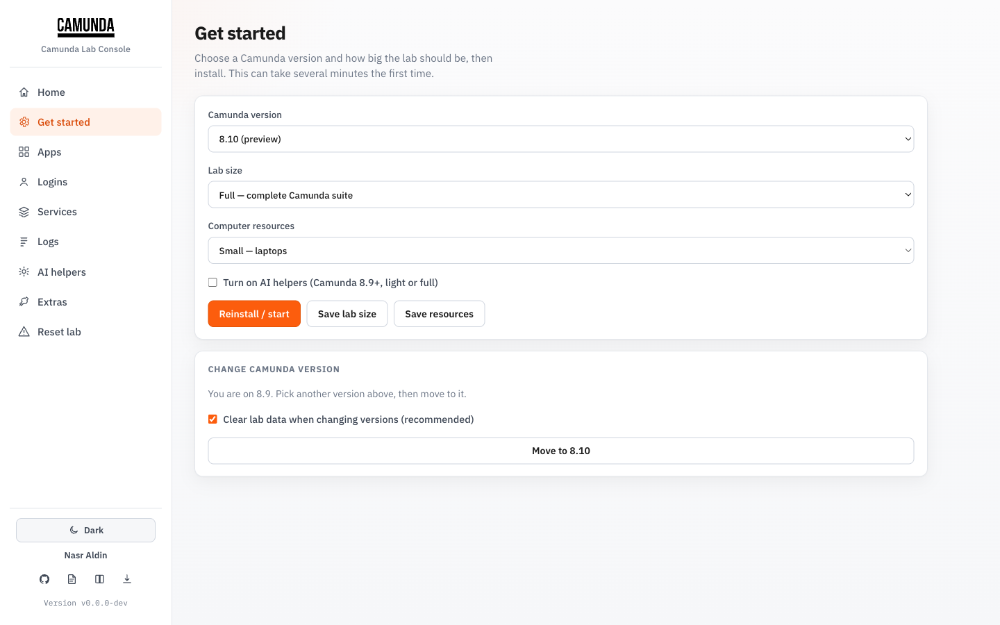
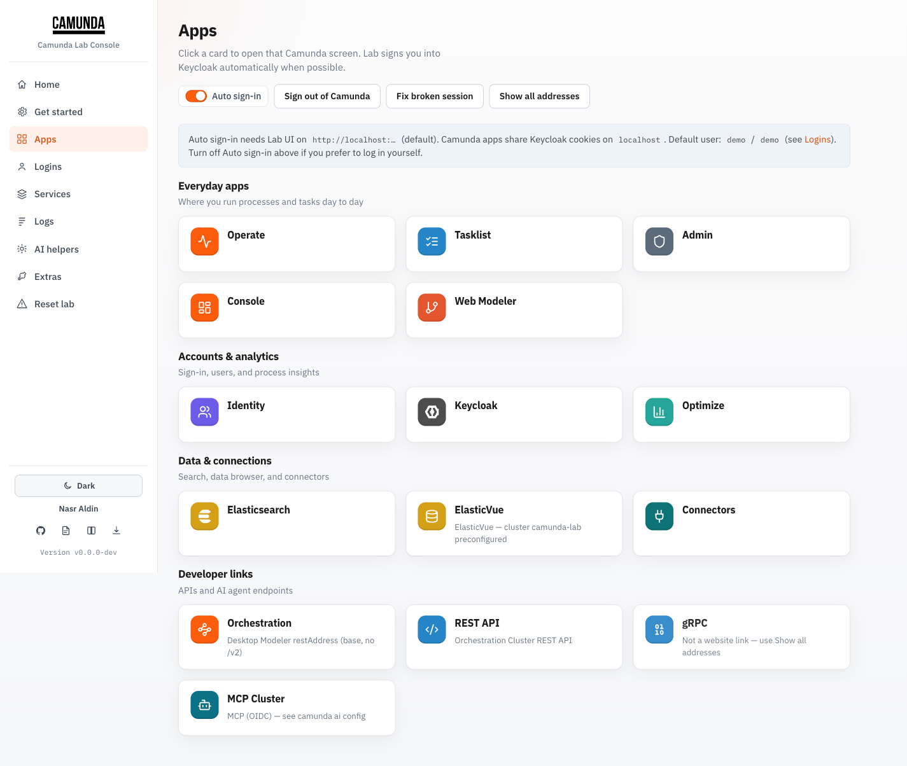
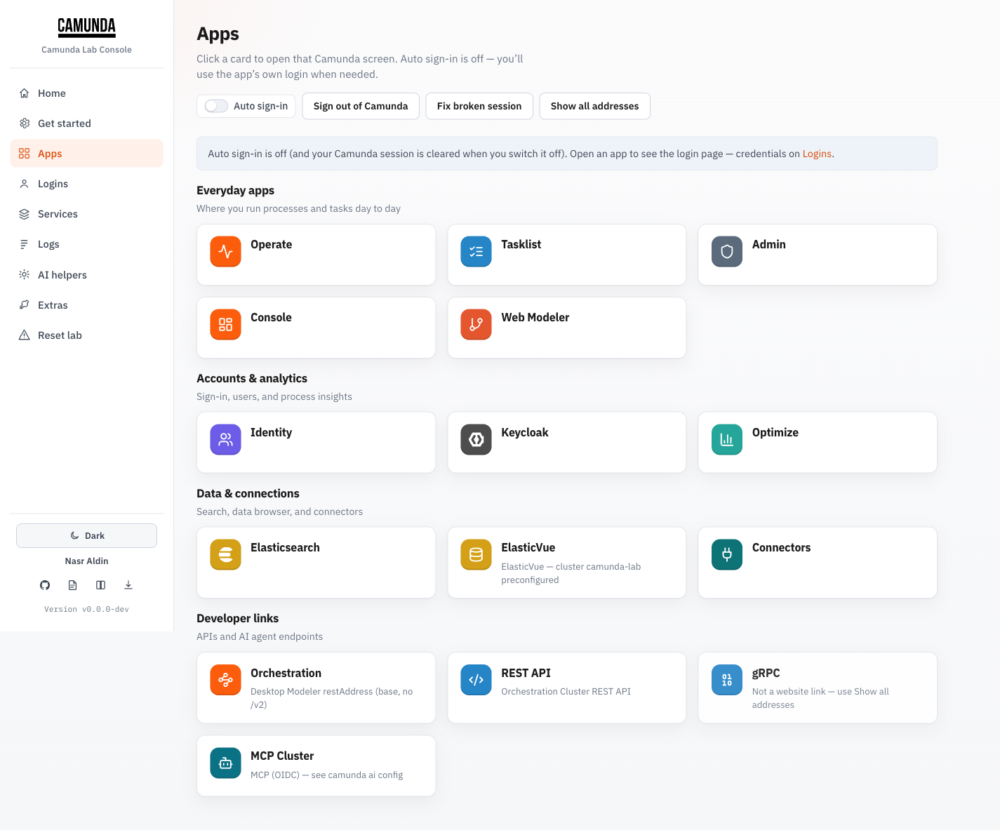
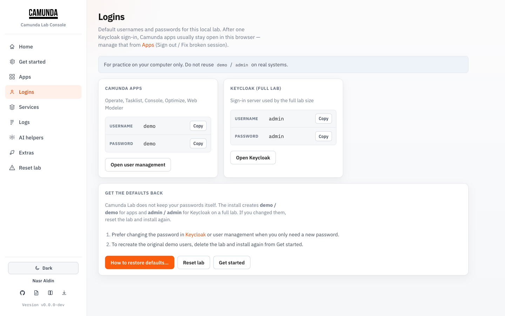
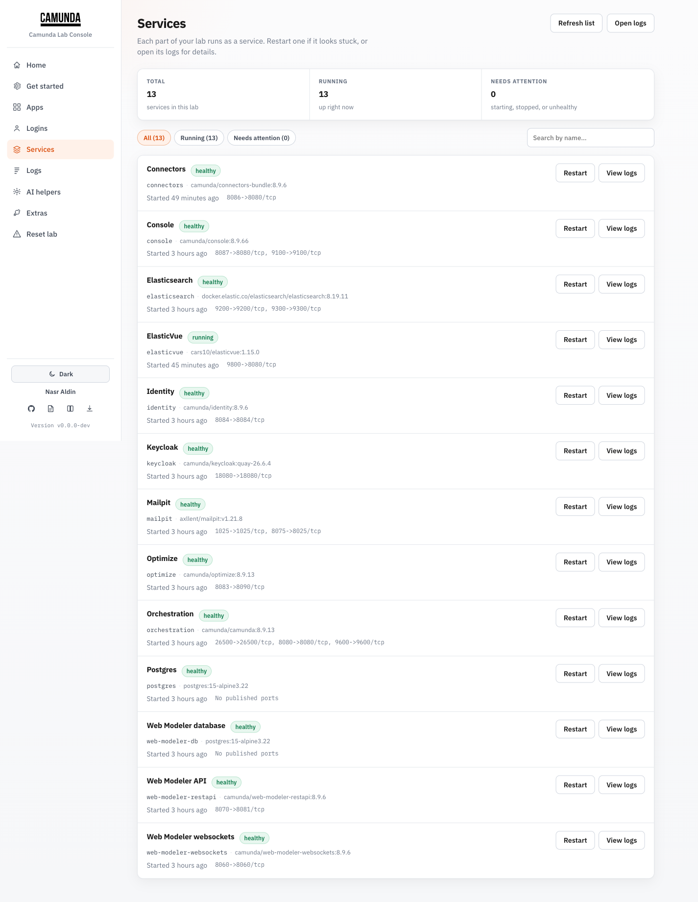
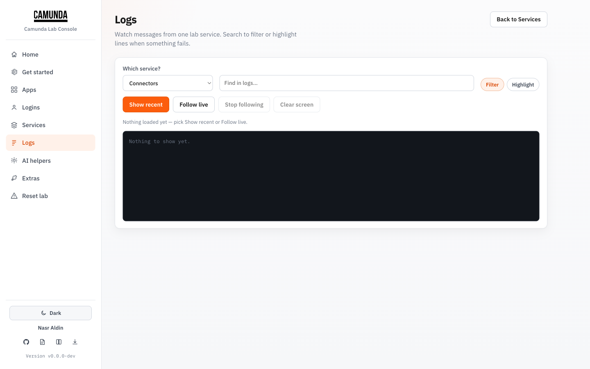
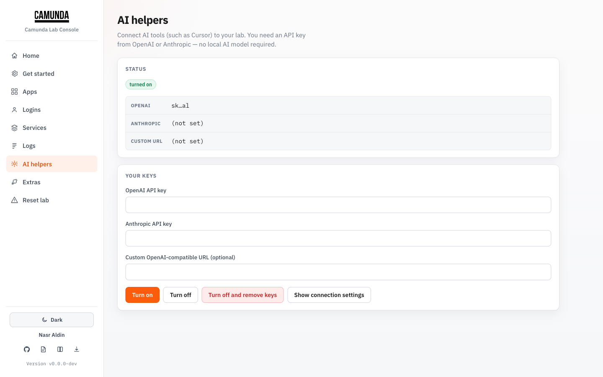
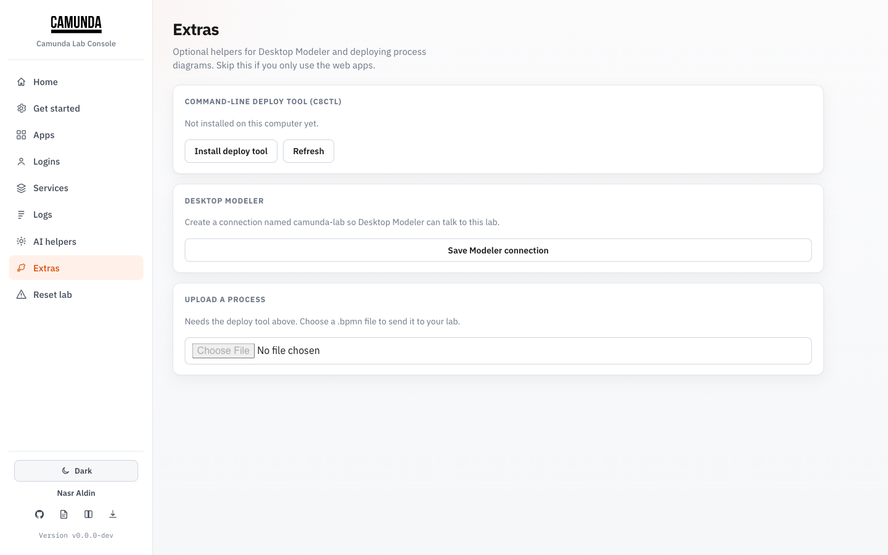
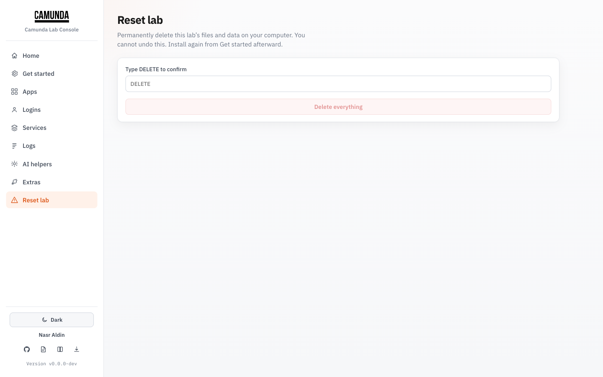

# Lab UI

The embedded **Camunda Lab Console** is a local browser control panel for the same workflows as the CLI — install, open apps, tail logs, AI helpers, and reset — without living in the terminal.

`camunda install` (and `camunda up`) **start the UI in the background** automatically and open your browser on first install. You can also manage it manually:

```bash
camunda ui              # ensure background UI + open browser
camunda ui --no-open    # background only
camunda ui --foreground # block in this terminal (Ctrl+C to stop)
camunda ui --stop       # stop background UI
camunda ui logs         # recent background log lines
camunda ui logs -f      # follow background logs
# http://localhost:9090  (loopback only, no auth)
```

Default bind is **`localhost`** (not `127.0.0.1`) so Keycloak SSO cookies match Camunda apps. Override with `--host` / `--port` if needed (`CAMUNDA_LAB_UI_PORT`).

!!! tip "Quick look"
    

---

## Start and layout

| Control | Where | What it does |
| --- | --- | --- |
| Sidebar | Left | Jump between Home, Get started, Apps, Logins, Services, Logs, AI helpers, Extras, Reset lab |
| Light / Dark | Sidebar footer | Theme preference (saved in the browser) |
| Version | Sidebar footer | CLI version currently serving the UI |
| Project links | Sidebar footer | GitHub, help docs, Camunda Docs, releases |

No authentication — only bind loopback addresses.

---

## Home

Status strip (version, profile, resources), lab actions (Start / Stop / Restart), health checks (Doctor / Test apps), optional CLI update, and project links.


**Useful actions**

- **Start lab / Stop lab / Restart lab** — same idea as `camunda up` / `down` / restart
- **Doctor** — Docker / compose / config sanity (`camunda doctor`)
- **Test apps** — quick HTTP probes (`camunda smoke`)
- **Update** — when a newer CLI release is available

---

## Get started

Install or switch Camunda minor, profile (`light` / `full` / `modeler`), and resource size (`small` / `balanced` / `power`). Optional AI enable fields for OpenAI-compatible keys.



Use this when you want a guided install instead of `camunda install` prompts.

---

## Apps

Open Operate, Tasklist, Admin, Console, Identity, Optimize, Web Modeler, ElasticVue, and more — grouped by everyday use.

**Developer endpoints** (orchestration base, REST `/v2`, gRPC, connectors, MCP) are **not** web UIs. Each card explains the endpoint, links to official Camunda docs, and has **Test health** (Lab calls the official verify path — e.g. `:9600/actuator/health`, `/v2/topology`, TCP `26500`).



### Auto sign-in

Auto sign-in is for labs that include **Keycloak** (full profile). On a **light** lab there is no Keycloak, so the switch is hidden and apps open with direct links.

| Setting | Behavior |
| --- | --- |
| **On (default, full lab)** | Lab warms the Keycloak session as `demo` / `demo`, then opens the app so you skip the login form |
| **Off (full lab)** | Apps open directly; Lab also signs you out of Camunda so the next open shows the Keycloak login page |
| **Light lab** | Auto sign-in stays off. Log in once on Operate/Tasklist/Admin (`demo` / `demo`); they share one Camunda session cookie. Lab disables Camunda CSRF locally so opening apps in new tabs does not force login again. |

Preference is stored in the browser (`camunda-lab-auto-sso`) and only applies when Keycloak is present.



### Session tools

Shown only when Keycloak is in the lab:

- **Sign out of Camunda** — opens Keycloak logout
- **Fix broken session** — same logout path, for login loops / mixed `localhost` vs `127.0.0.1` cookies

Always available:

- **Show all addresses** — copy raw URLs for Desktop Modeler, clients, or AI tools

!!! note "localhost only"
    Use `http://localhost:…` for Lab UI and Camunda apps. Mixing `127.0.0.1` breaks shared cookies (Keycloak SSO on full labs, or the Camunda session cookie on light labs).

---

## Logins

Default credentials for apps and Keycloak, with copy buttons.



Typical defaults from Camunda’s compose files:

| Who | User | Password |
| --- | --- | --- |
| Operate / Tasklist / apps | `demo` | `demo` |
| Keycloak admin (full) | `admin` | `admin` |

---

## Services

Friendly names for Compose containers, status/metrics strip, filter chips, search, **Restart**, and **View logs**.



---

## Logs

Pick a service, stream recent logs, then **Filter** (hide non-matching lines) or **Highlight** (keep context, mark matches). Near-bottom auto-scroll; link back to Services.



---

## AI helpers

Enable / disable AI Agent connector secrets and view MCP endpoint hints for Cursor / Claude (8.9+). Same surface as `camunda ai enable` / `config`.



Details: [AI and MCP](ai-mcp.md).

---

## Extras

Install or check **c8ctl**, Desktop Modeler profile helpers, and light deploy helpers.



---

## Reset lab

Danger zone — wipe `~/.camunda-lab` and volumes (same idea as `camunda nuke`). Confirm carefully.



---

## Reproduce these shots

```bash
camunda install --version 8.9 --profile full --resources small --yes
camunda wait
camunda ui --port 9091 --no-open
# open http://localhost:9091/ — Home, Apps, Services, …
```

Camunda app UIs (Operate, Tasklist, …) are documented separately: [App screenshots](screenshots.md).
