# App screenshots

Captured from a live **camunda-lab** full stack:

```bash
camunda install --version 8.9 --profile full --resources small --yes
camunda wait
camunda smoke
```

Stack: Camunda **8.9** full (orchestration, Identity, Keycloak, Console, Optimize, Web Modeler, Elasticsearch, ElasticVue, connectors).  
App login: **demo** / **demo**. Keycloak admin: **admin** / **admin**.

Open the same UIs with `camunda urls` and `camunda open <app>`.

---

## Operate — login (OIDC)

`camunda open operate` redirects through Camunda Identity / Keycloak SSO on the full profile.

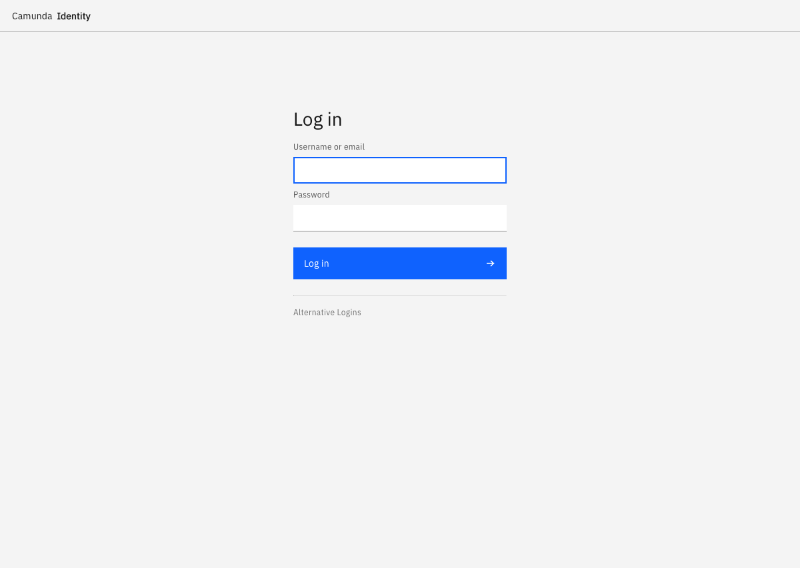

---

## Operate — dashboard

After login you land on the Operate dashboard — empty until you deploy and run processes.

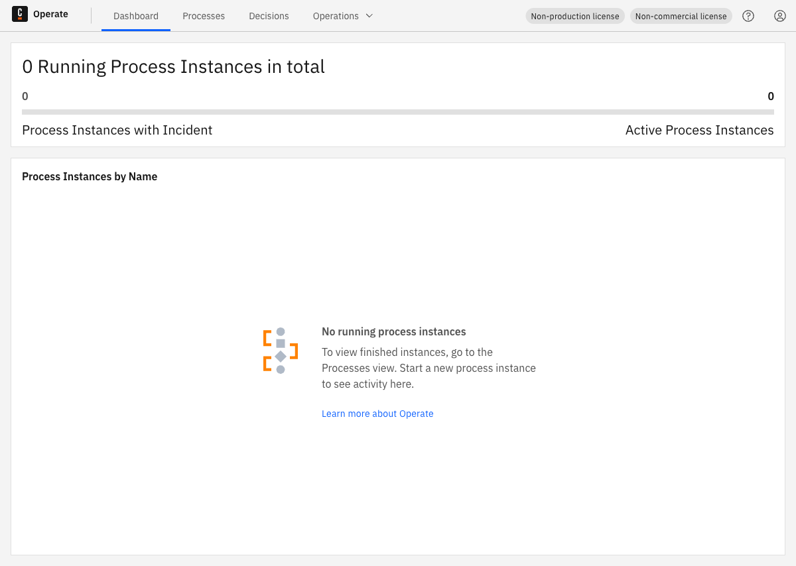

---

## Operate — processes

Process instances view with Active / Incidents filters.

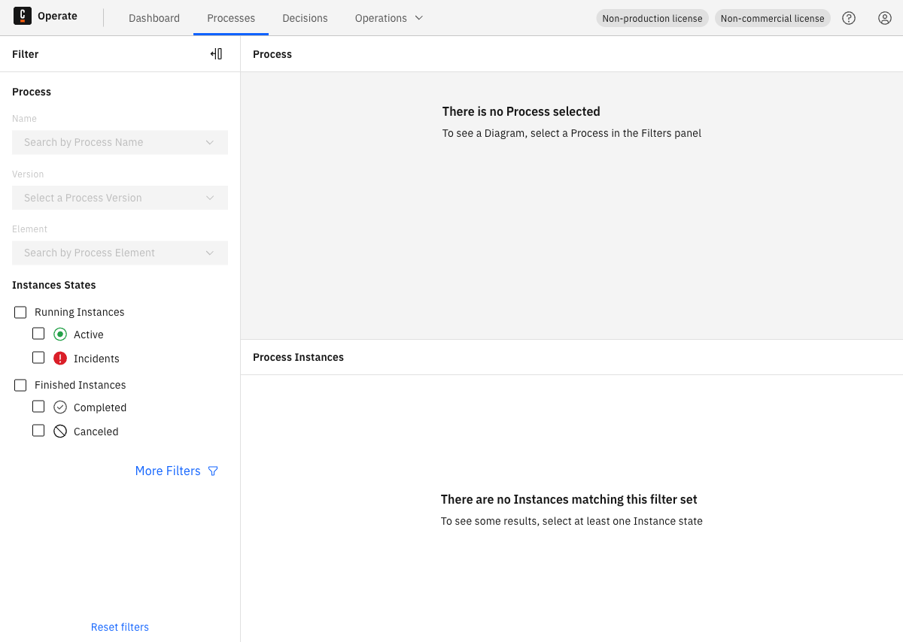

```bash
camunda open operate
```

---

## Tasklist

`http://localhost:8080/tasklist` — human tasks from your BPMN.

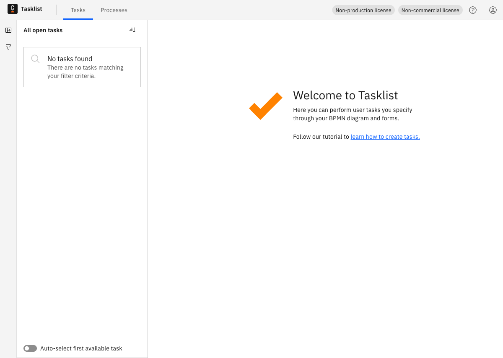

```bash
camunda open tasklist
```

---

## Admin (orchestration)

`http://localhost:8080/admin` — mapping rules, users, groups, roles, authorizations for the orchestration cluster.

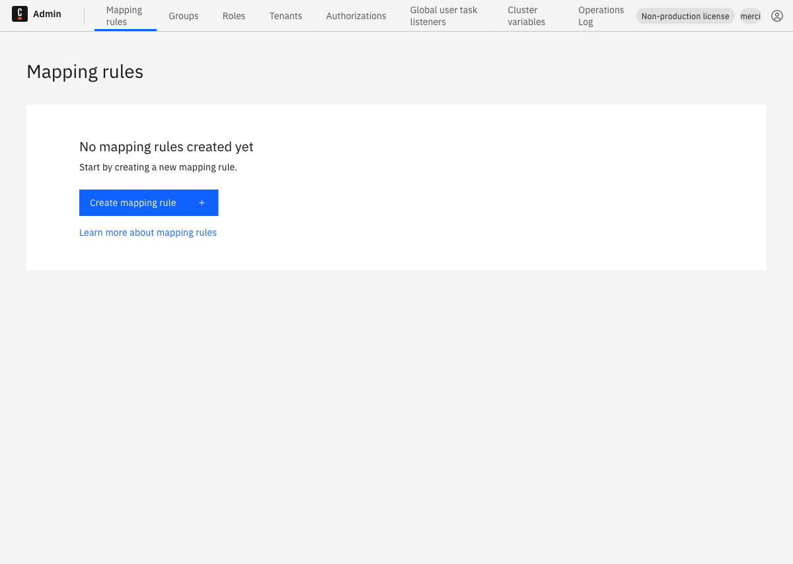

```bash
camunda open admin
```

---

## Console

`http://localhost:8087` — Camunda Console (full profile).

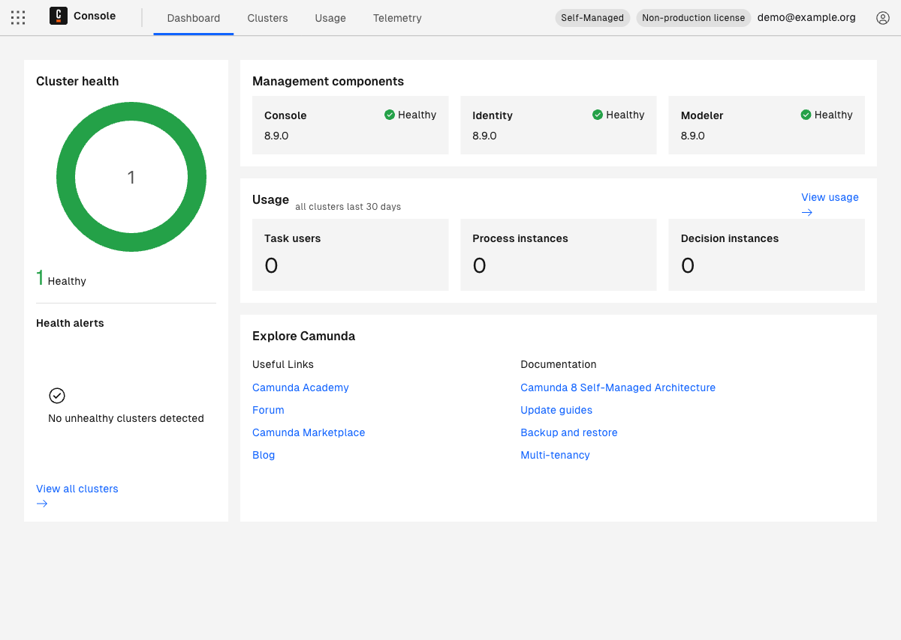

```bash
camunda open console
```

---

## Identity

`http://localhost:8084` — Management Identity (applications, roles, permissions).

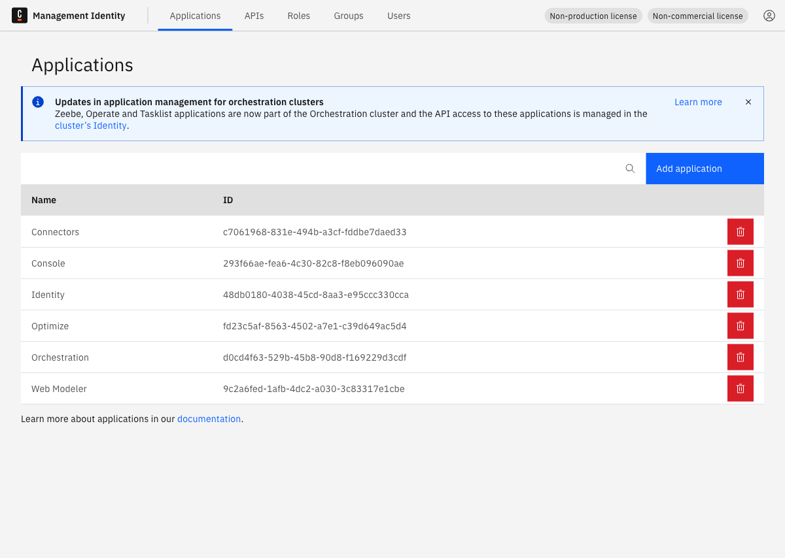

```bash
camunda open identity
```

---

## Optimize

`http://localhost:8083` — process analytics dashboards.

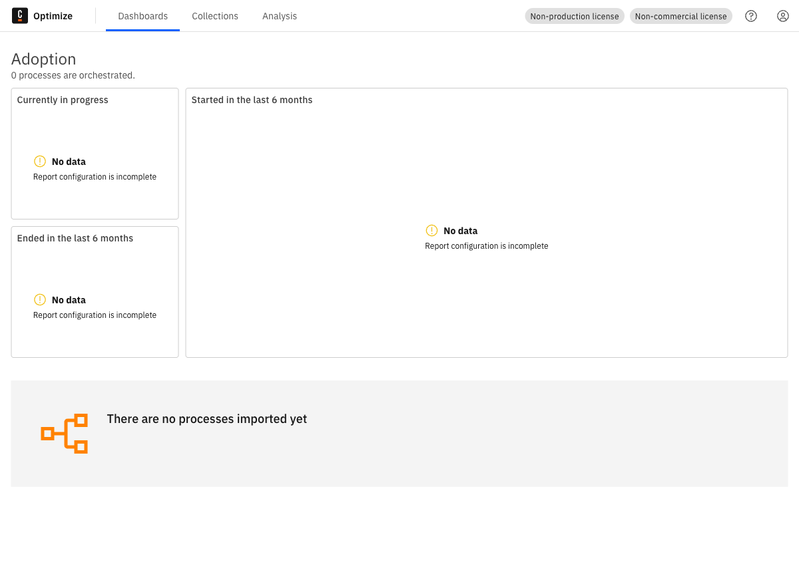

```bash
camunda open optimize
```

---

## Web Modeler

`http://localhost:8070` — Web Modeler home (SSO via Keycloak on full).

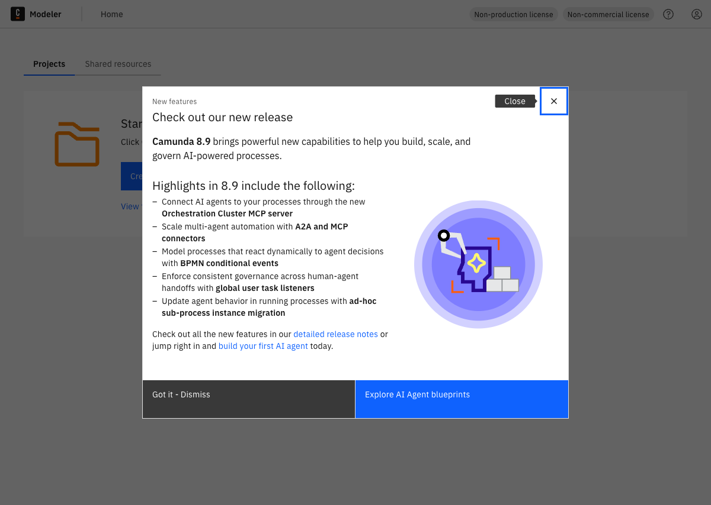

```bash
camunda open web-modeler
```

---

## Keycloak

`http://localhost:18080/auth/admin/` — Keycloak Administration Console sign-in (**admin** / **admin**).

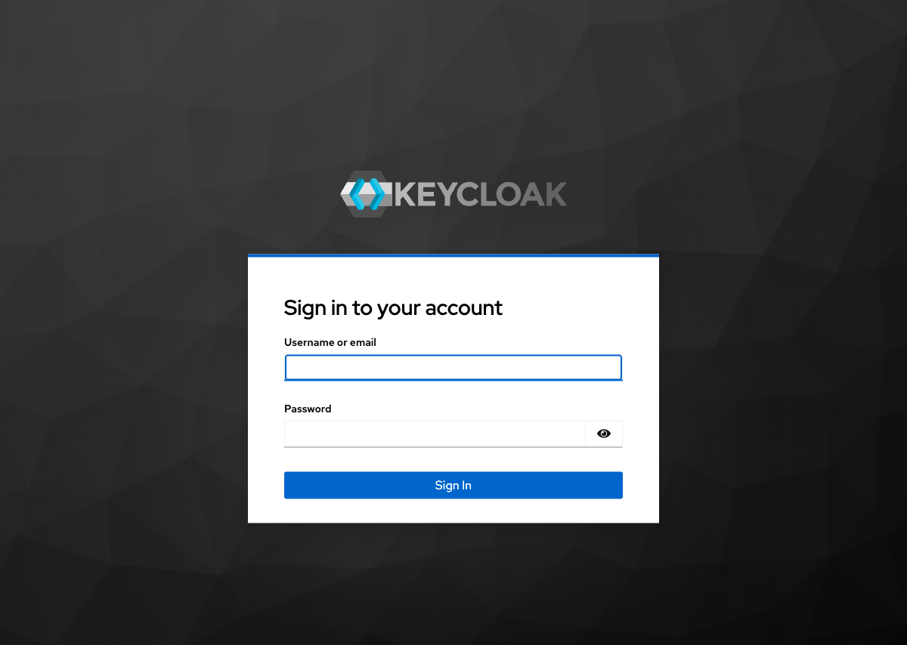

```bash
camunda open keycloak
```

---

## ElasticVue

`http://localhost:9800` — Elasticsearch GUI with cluster **camunda-lab** preconfigured to `http://localhost:9200` (no manual setup).

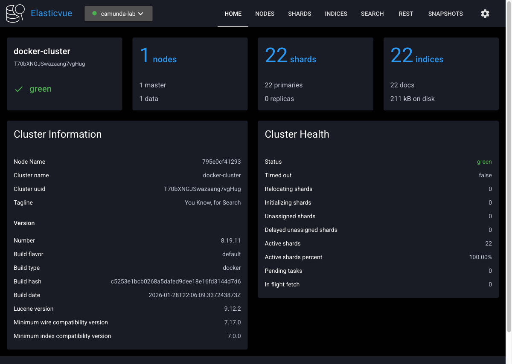

```bash
camunda open elasticvue
```

---

## Elasticsearch cluster health

`http://localhost:9200/_cluster/health?pretty`

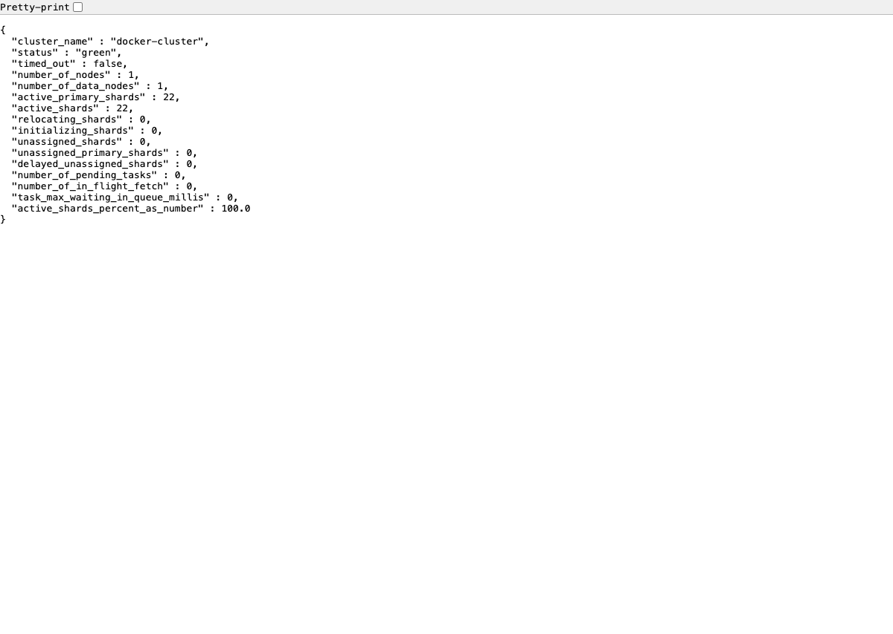

---

## Connectors health

`http://localhost:8086/actuator/health`

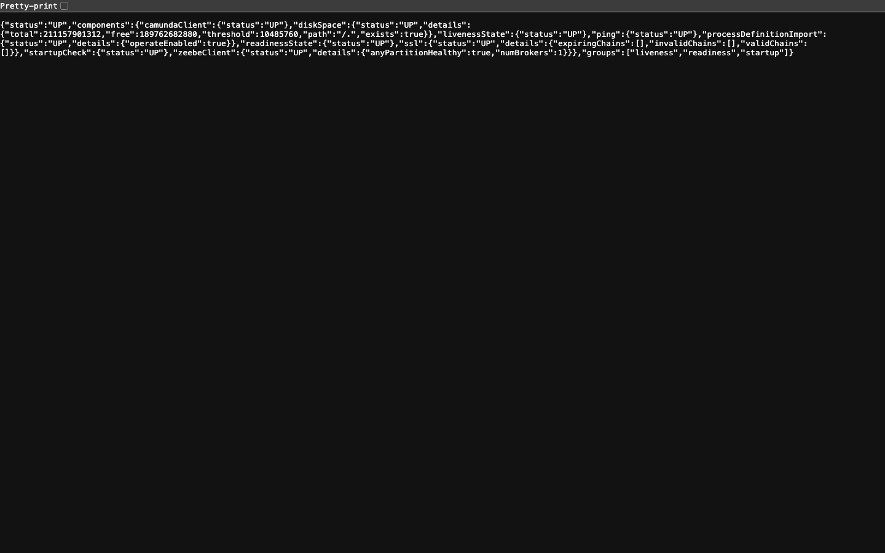

---

## Reproduce these shots

```bash
brew upgrade camunda-lab   # or: make install
camunda install --version 8.9 --profile full --resources small --yes
camunda wait
camunda smoke
camunda urls
camunda open operate
camunda open elasticvue
```

Ports also differ by minor — especially **8.7** vs **8.8** vs **8.9+**. See [Profiles and versions](profiles.md).
